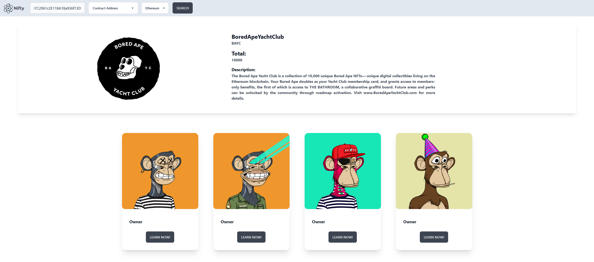

# Nifty

Fetch NFTs from different chains, either from a specific address or from a contract address. Check who owns the NFT and get all the details of it.

<div style="text-align:center">

</div>

## Next up:

- [ ] Fetch data from specific address/wallet
- [ ] Add NFT details modal
- [ ] Add API key by the user option
- [ ] Save API key in the local storage

## Recent Add-ons:

- [x] Add contract details section
- [x] Add Chain selection option

## Install dependencies:

```bash
npm install
```

Create a .env file and add your API key to it:

```bash
VITE_NFTPORT_API_KEY='YOUR_API_KEY_HERE'
```

## Run the dev server:

```bash
npm run dev
```
