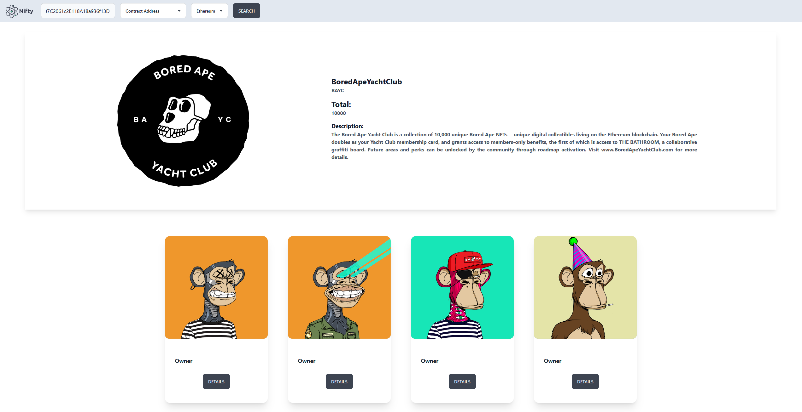
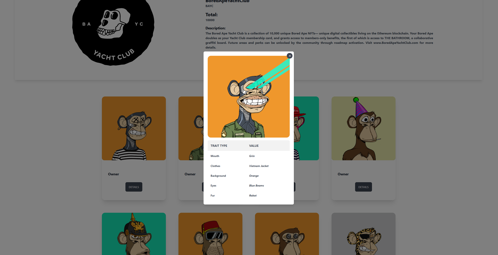
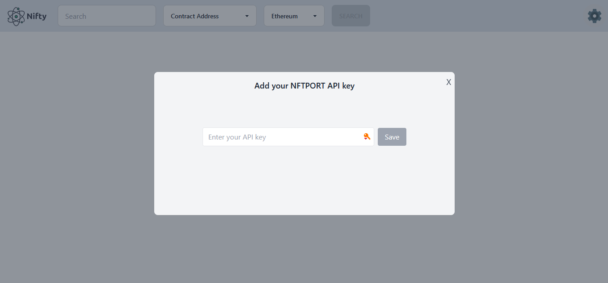

# Nifty

Fetch NFTs from different chains, either from a specific address or from a contract address. Check who owns the NFT and get all the details of it.

<div style="text-align:center">

</div>
<div style="text-align:center">

</div>

## Recent Add-ons:

- [x] Add API key by the user option (14/08/2023)
- [x] Save API key in the local storage (14/08/2023)
- [x] Add NFT details modal (10/04/2023)
- [x] Add wallet details modal (06/04/2023)
- [x] Fetch data from specific address/wallet (04/04/2023)
- [x] Add contract details section (01/04/2023)
- [x] Add Chain selection option (01/04/2023)

## Install dependencies:

```bash
npm install
```

~~Create a .env file and add your API key to it:~~

```bash
Now add the API-KEY directly into the app
```

<div style="text-align:center">

</div>

## Run the dev server:

```bash
npm run dev
```
